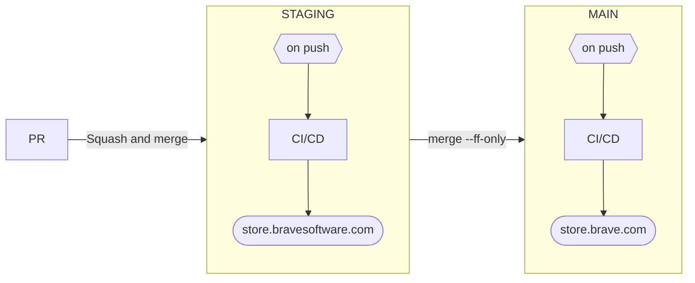

# Brave Merch Store

## Architecture
This repository is a monorepo with two services:

### Storefront
The storefront is built using [SvelteKit](https://kit.svelte.dev/). All queries to the API are defined using GraphQL, but via an autogenerated SDK created by [`@graphql-codegen`](https://the-guild.dev/graphql/codegen). E.g.

```graphql
query FeaturedProducts {
  products(where: { isFeatured: { equals: true } }) {
    ...ProductSummary
  }
}
```

```javascript
const { products } = await sdk.FeaturedProducts();
```

### API
The API is powered by [Keystone](https://keystonejs.com/), which is a CMS that provides a GraphQL API which the storefront consumes. Note that this API is not publicly available, and is restricted to requests coming from the `storefront` service.

All of the data comes from Printful via their [API](https://developers.printful.com/docs/).

## Production deployment
### Frontend

#### Build

```bash
npm install && npm run build
```

#### Start

```bash
npm run start
```

You'll need the following environment variables:

```
ENVIRONMENT=/* staging | production */
BASE_URL=/* environment specific domain for store frontend (IMPORTANT: no trailing slash) */
PUBLIC_ASSETS_PATH=/* public URL to images S3 bucket e.g. https://cdn.store.brave.com */
API_URL=/* url (not including the path) where GraphQL api can be found */
PRINTFUL_API_TOKEN=/* api token from printful */
PRINTFUL_BASE_URL=https://api.printful.com
PRINTFUL_STORE_ID=/* store id from printful */
STRIPE_KEY=/* key for making requests to Stripe */
STRIPE_WEBHOOK_SECRET=/* key for making listening to Stripe webhooks */
SENTRY_DSN=/* DSN for Sentry alerts */
```

### API

#### Build

```bash
cd api && npm install && npm run build
```

#### Start

```bash
npm run start
```

You'll need the following environment variables:

```
ENVIRONMENT=/* staging | production */
SESSION_SECRET=/* 32 character code */
DB_URL=/* db url, e.g. localhost:5432 */
S3_IMAGES_BUCKET=/* bucket name from s3 */
PUBLIC_ASSETS_PATH=/* public URL to images S3 bucket e.g. https://cdn.store.brave.com */
PRINTFUL_API_TOKEN=/* api token from printful */
PRINTFUL_BASE_URL=https://api.printful.com
PRINTFUL_STORE_ID=/* store id from printful */
SENTRY_DSN=/* DSN for Sentry alerts */
```

## Local development

### Setup

#### PostgreSQL
In order to develop locally, you must have [PostgreSQL](https://www.postgresql.org/download/) downloaded and running on your machine.

#### Environment variables
You'll also need to create two `.env` files – one in the root of the repository, and the other in the `api/` folder:

```bash
touch .env
touch api/.env
```

The files should be populated with the respective sets of variables as described in [Production deployment](#production-deployment), using the appropriate values for your local environment.

#### Dependencies
Ensure dependencies are installed for both the root director and the `api/` directory.

```bash
npm install
cd api && npm install
cd ../ # return to root for subsequent commands
```

### Start API (Keystone)
In order to start the API, open a new terminal window, `cd` into `api`, and start the service.

```bash
npm run dev
```

Running the above command will create the database if necessary and run the migrations to create the necessary tables.

You can populate the DB by going to `http://localhost:3000/sync-store` and clicking the `Sync now` button. **Note** that in our staging and production environments, images are synced to our own S3 bucket, and we do not request images directly from Printful's CDN on the storefront. However when running locally, these images _**will**_ be requested from Printful's CDN unless you've authenticated with AWS with the appropriate role.

### Start storefront (SvelteKit)
Leaving the terminal window open for the API, start the storefront from the root of the repository. In order to run this, you'll need to provide the `PUBLIC_ASSETS_PATH` environment variable in order for it to be available during the initial build phase. The value should use the staging URL for the image CDN: `https://cdn.store.bravesoftware.com`.

```bash
PUBLIC_ASSETS_PATH=https://cdn.store.bravesoftware.com npm run dev
```

### Start watch script for `codegen` (optional)
**NOTE:** this now automatically starts via [`concurrently`](https://github.com/open-cli-tools/concurrently) when running `npm run dev` as [described above](#start-storefront-sveltekit).

The storefront uses an SDK to interact with the API which is automatically generated by [`@graphql-codegen`](https://the-guild.dev/graphql/codegen) from GraphQL queries defined in `src/lib/graphql/queries.graphql`.

In order to watch for changes to `src/lib/graphql/queries.graphql` and trigger this generation process, you can run the following command **in a new terminal** (this would be the third necessary terminal).

```bash
npm run gen -- --watch "src/**/*.graphql"
```

## Branch promotion
Upon approval, PR branches are merged to `staging` via `Squash and merge` and the staging environment is rebuilt via CI/CD. Once functionality is confirmed on the staging site and the feature is ready to move to production, the `staging` branch is merged into `main` using the `--ff-only` flag on a local machine and then pushed to the remote `main` branch.

E.g.

```bash
git fetch
git merge --ff-only origin/staging
git push
```

Pushing to `main`, like `staging`, triggers CI/CD to rebuild the production environment.

### Diagram of branch flow


